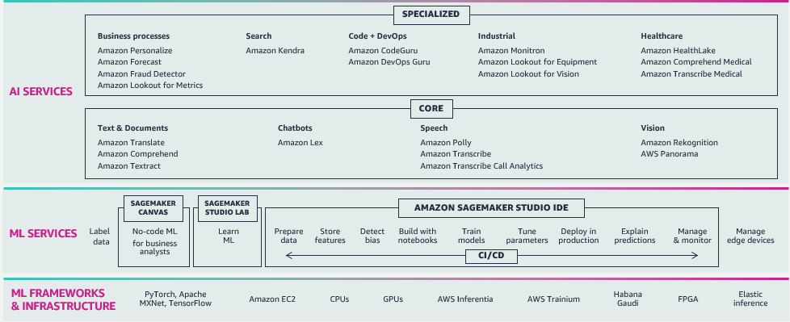

## AWS ML JP

AWS で機械学習をはじめる方法を学ぶことができるリポジトリです。

## :books: AWSの機械学習サービス

AWS で機械学習をはじめる方法は **AI Services** 、 **ML Services** 、 **ML Frameworks/Infrastructure** の 3 つあります(下図参照)。

* [AI Services](https://aws.amazon.com/jp/machine-learning/ai-services/)
   * アプリケーション開発者の方がWeb API形式で簡単に機械学習機能を扱えるサービスです。
   * [Amazon Personalize](https://aws.amazon.com/jp/personalize/) は推薦機能が実装できるサービス ([BASE様の事例](https://devblog.thebase.in/entry/2021/12/17/110000))、 [Amazon Rekognition](https://aws.amazon.com/jp/rekognition/) は顔やブランドロゴの検出といった画像認識機能を実装できるサービス([千株式会社様の事例](https://sencorp.co.jp/4713/))です。他にもユースケースに応じた様々な AI Services があります。
* [ML Servies](https://aws.amazon.com/jp/machine-learning/)
   * データサイエンティストの方が機械学習モデルを開発する時、前処理、計算資源の調達、学習結果の管理やモデルのデプロイなどを行いやすくするサービスです。
   * [Amazon SageMaker](https://aws.amazon.com/jp/sagemaker/) は機械学習モデル開発を行うための統合開発環境で、 JupyterLab をベースにした環境からデータの前処理、学習、デプロイなどに必要なサービスを簡単に呼び出せます。
   * [Amazon SageMaker Studio Lab](https://studiolab.sagemaker.aws/) は無料で利用できるエントリー版ですが、 GPU やストレージなど機械学習の学びから価値検証に十分なスペックを備えています。
   * [Amazon SageMaker Canvas](https://aws.amazon.com/jp/sagemaker/canvas/) は機械学習の専門知識がない業務部門の方でも表計算ソフトの延長線の感覚で機械学習モデルの構築と予測が行えるサービスです。
* [ML Frameworks/Infrastructure](https://aws.amazon.com/jp/machine-learning/infrastructure/?nc1=h_ls)
   * データサイエンティストの方が機械学習モデルを開発する時、利用したい機械学習フレームワークやデバイスに合わせた環境をセットアップできるようにするサービスです。
   * [AWS Deep Learning Containers](https://aws.amazon.com/jp/machine-learning/containers/) は各種フレームワークごとに最適化されたコンテナイメージで学習・推論が高速化されます。
   * [AWS Inferentia](https://aws.amazon.com/jp/machine-learning/inferentia/) は推論、 [AWS Trainium](https://aws.amazon.com/jp/machine-learning/trainium/) は学習にそれぞれ特化したチップで、高スループットかつ高コスト効率な推論、学習を可能にします。

## :computer: 学習の準備

本リポジトリのコンテンツは主に Jupyter Notebook で作成されています。コンテンツを動かすため、次の準備をしておいてください(必要なセットアップはコンテンツに依存します)。

* [AWS アカウントの作成](https://aws.amazon.com/jp/register-flow/)
* [SageMaker Studio Domainの作成](https://docs.aws.amazon.com/ja_jp/sagemaker/latest/dg/onboard-quick-start.html)
* [S3 bucketの作成](https://docs.aws.amazon.com/ja_jp/AmazonS3/latest/userguide/create-bucket-overview.html)
* [IAM ユーザー、ロールの作成](https://docs.aws.amazon.com/ja_jp/IAM/latest/UserGuide/introduction.html)
  * 必要に応じ、コンテンツで動かすサービスにとって適切なユーザー、ロールを作成します。

## :notebook: 学習コンテンツ

### Amazon SageMaker

AI/ML の BlackBelt シリーズである [AI/ML DarkPart](https://www.youtube.com/playlist?list=PLAOq15s3RbuL32mYUphPDoeWKUiEUhcug) で SageMaker の使い方を解説しています！ そもそも機械学習のプロジェクトはどうやって始めればいいのかに疑問をお持ちの方は、 [AI/ML LightPart](https://www.youtube.com/playlist?list=PLAOq15s3RbuJ81DBtH66tQL2_9H519ODQ) の動画や [ML Enablement Workshop](https://github.com/aws-samples/aws-ml-enablement-workshop) の資料をご参考ください。

|No   |Process|Title|Content|Video|
|:----|:------|:----|:----|:----|
|1    |Train|Amazon SageMaker Training で機械学習のモデル開発を楽にする| - ||
|2    |Train|Amazon SageMaker Training ハンズオン編|||
|3    |Train|Amazon SageMaker による実験管理|||
|4    |Deploy|Amazon SageMaker 推論 Part1 推論の頻出課題とSageMakerによる解決方法| - ||
|5    |Deploy|Amazon SageMaker 推論 Part2すぐにプロダクション利用できる！モデルをデプロイして推論する方法 |||
|6    |Deploy|Amazon SageMaker 推論 Part3（前編）もう悩まない！機械学習モデルのデプロイパターンと戦略 | - ||
|7    |Deploy|Amazon SageMaker 推論 Part3（後編）もう悩まない！機械学習モデルのデプロイパターンと戦略 | - ||
|8   |Monitor|Amazon SageMaker モニタリング Part1 | - ||
|9    |Monitor|Amazon SageMaker モニタリング Part2 |||
|10    |Monitor|Amazon SageMaker モニタリング Part3 |||

[Amazon SageMakerの概要](./sagemaker/) では Amazon SageMaker の全体像と動画で解説しているコードも含めたコンテンツの詳細を確認できます。

## :hammer_and_wrench: 実践コンテンツ

AWS で機械学習を実践する時の参考となるサンプルコードなどを紹介します。

* 機械学習タスク別サンプルコード
   * [画像処理](tasks/vision/)
   * [自然言語処理](tasks/nlp/)
   * [音声処理](tasks/audio/)
* 機械学習基盤の構築
   * [MLOps](sagemaker/mlops/)
* 機械学習フレームワークの実装を SageMaker へ移行する
   * [PyTorch](frameworks/pytorch/)
   * [TensorFlow](frameworks/tensorflow/)
   * [AutoGluon](frameworks/autogluon/)
   * [XGBoost](frameworks/xgboost)
   * [PaddlePaddle](frameworks/paddlepaddle/)

## Contribution

本リポジトリへの Contribution を歓迎します！ Contribution の方法は [CONTRIBUTING](CONTRIBUTING.md#security-issue-notifications) をご参照ください。

フォルダの構成は次のようになっています。

* `ai-services`
  * AWS の AI サービスを使いたい開発者にむけて、使い方を学ぶためのコンテンツを保存する。
* `frameworks`
  * すでに TensorFlow や PyTorch でモデルを開発しているデータサイエンティストが、モデルを SageMaker 上で学習、推論させるための移行方法を学ぶためのコンテンツを保存する。
* [`sagemaker`](./sagemaker/)
  * 機械学習モデル開発の効率化やパイプライン化を検討している開発者が、 Amazon SageMaker をどのように使えばそれらが実現できるか学ぶためのコンテンツを保存する。
* `tasks`
  * 画像のセグメンテーションや物体検知、自然言語処理のQAや要約など、個別具体的なタスクを解こうとするデータサイエンティストが、 SageMaker を使用しどのようにモデルの開発を効率化できるか学ぶためのコンテンツを保存する。特定タスクを解くリポジトリへのリンクも紹介する。
* [`solutions`](./solutions/)
  * 製造業での異常検知モニタリングやコールセンターの問合せ分析など、特定の業務プロセスを効率化/差別化したい業務有識者やデータサイエンティストが、 SageMaker と他のサービスを組み合わせどのようにソリューションを構築できるのか学ぶためのコンテンツを保存する。ソリューションのリポジトリへのリンクも紹介する。

## License

This library is licensed under the MIT-0 License. See the [LICENSE](LICENSE) file.
