# Amazon Personalize ハンズオン

本ハンズオンは Amazon Personalize サービスと、 [Movie Lens](https://grouplens.org/datasets/movielens/) というデータセットを使い、映画のレコメンデーション機能をデプロイするハンズオンです。  
上記データセットについて、このコンテンツ内でダウンロードする処理が入っておりますが、Amazon Personalize の学習用途のみの利用に限り、プロダクション用途などでの利用はお控えください。

---

## 前提条件
本ハンズオンではJupyter Notebook を使用してPython によるプログラミングを行います。Python でのプログラミング知識をお持ちの方を対象としています。  
機械学習の基本的な概念は前提条件といたしますが、カスタムアルゴリズムの作成など、高度な機械学習の知識は必須ではありません。  
AWS に関する知識という面ではAmazon Personalize に関する知識は必須ではありませんが、IAM を利用した権限管理、S3 バケットの管理など、AWS の基本的なサービス、およびマネジメントコンソールの操作などに関する知識は必須となります。
Amazon Personalize のAPI を呼び出す環境としてAmazon SageMaker Notebook インスタンス、開発言語はPython を利用します。  
Amazon SageMaker、Jupyter Notebook、Python 自体の説明については本ハンズオンの対象外となります。  
また、今回はPython を利用しますが、本ハンズオンで実行している処理はAWS CLI などでも実行可能です。

## 手順概要

1. 本ハンズオンの [Python(boto3)](https://aws.amazon.com/jp/sdk-for-python/) の実行環境として SageMaker ノートブックインスタンスを立ち上げる
2. ハンズオンをするにあたって、 SageMaker ノートブックインスタンスのロールに必要なポリシーをアタッチする
3. ハンズオンのノートブックを開く（構成などの詳細もノートブックを参照）

---

## 本ハンズオンの Python(boto3) 実行環境として SageMaker ノートブックインスタンスを立ち上げる

**注：ノートブックインスタンスは起動中は課金対象となりますので、ハンズオン終了後に停止・削除してください。**

メールに添付されたURLをブラウザのシークレットモードで開きます。

「AWS Console」をクリックします。

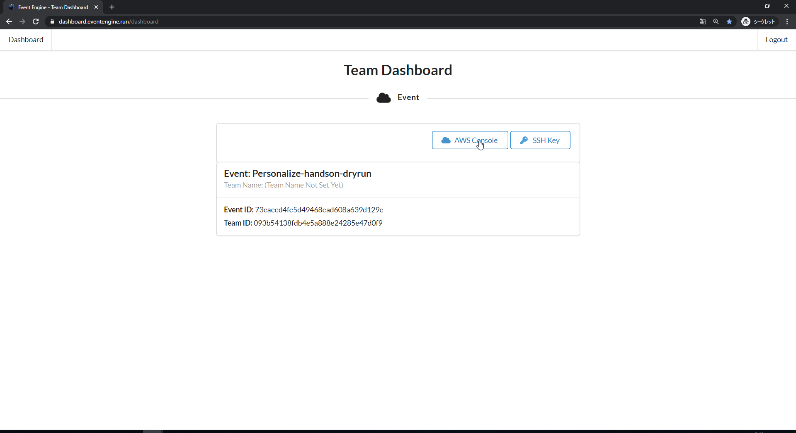

「Open AWS Console」をクリックします。

「サービスを検索する」の下にあるテキストボックスに「Sage」と入力し、表示された「Amazon
SageMaker」をクリックします。

左側のペインにある「ノートブックインスタンス」をクリックします。

右上にある「ノートブックインスタンスの作成」をクリックします。

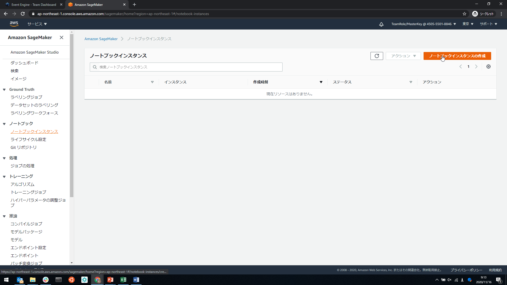

1.  「ノートブックインスタンス名」の下にあるテキストボックスに、任意のノートブックインスタンスの名前（アカウント内でユニーク）を入力します。\
    ex)\${username}-personalize-handson-\${DATE}

2.  IAM
    ロールの下にあるプルダウンから「新しいロールの作成」をクリックします。

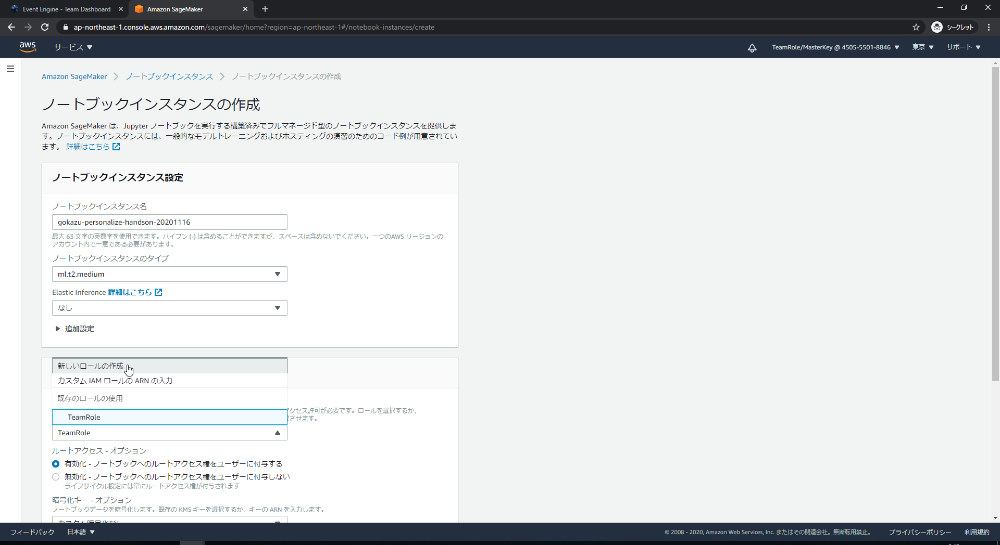

「任意の S3
バケット」のラジオボタンを活性化させ、「ロールの作成」をクリックします。

「成功！IAMロールを作成しました。」という表示が出たら、「Git
リポジトリ」をクリックします。

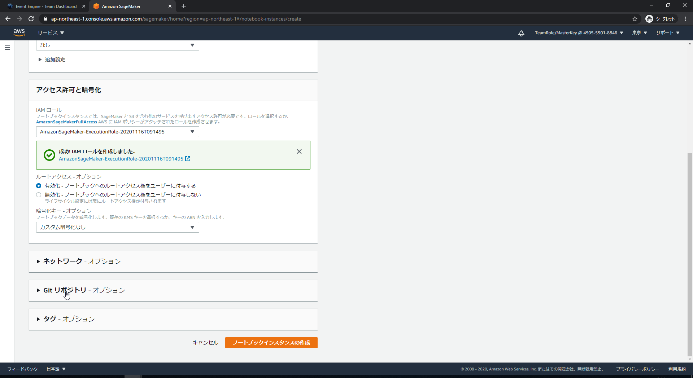

「リポジトリ」の下にある「なし」となっているプルダウンをクリックし、「このノートブックインスタンスのみにパブリック
Git リポジトリのクローンを作成する」を選択します。

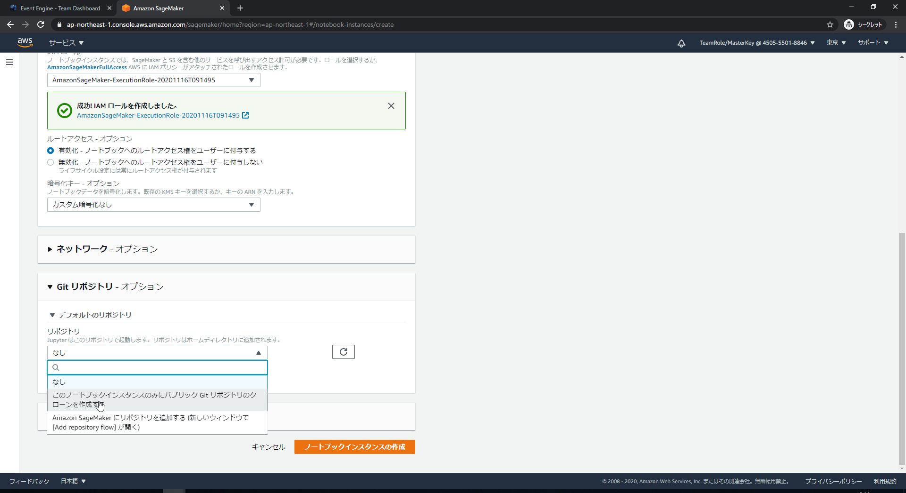

「Git リポジトリのURL」の下にあるテキストボックスに下記 URL
を入力します。

<https://github.com/aws-samples/aws-ml-jp>

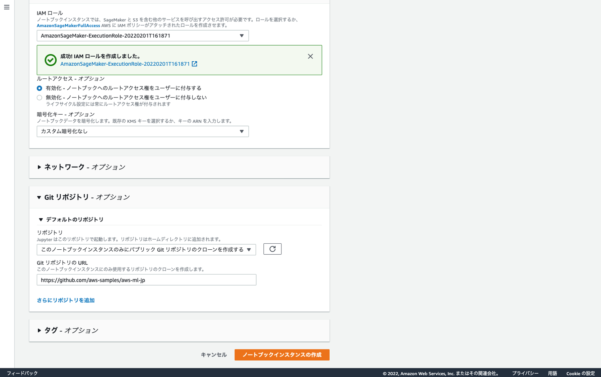

「成功！ノートブックインスタンスが作成されています。」と表示されているのを確認し、「ステータス」が「Pending」もしくは「In
progress」となっていることを確認します。

## ハンズオンをするにあたって、 SageMaker ノートブックインスタンスのロールに必要なポリシーをアタッチする

左上の「サービス」をクリックし、「iam」とテキストボックスに入力し、出現した「IAM」サービスをクリックします。

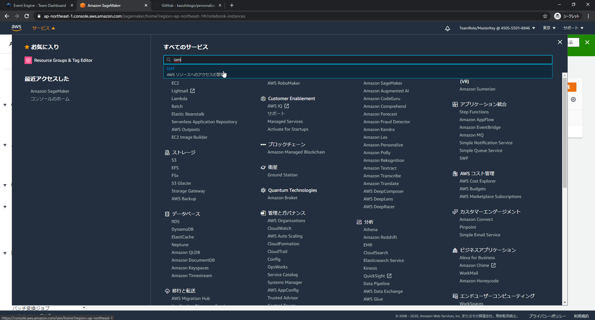

左のペインから「ロール」をクリックします。

ロール一覧が表示されるので、「AmazonSageMaker-ExecutionRole-YYYYMMDDThhmmss
」をクリックします。

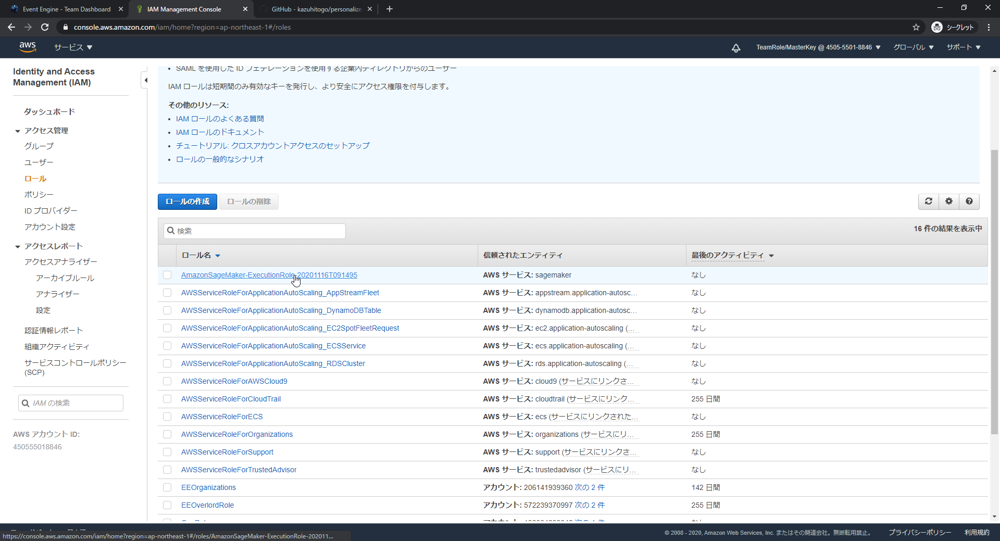

「ポリシーをアタッチします」をクリックします。

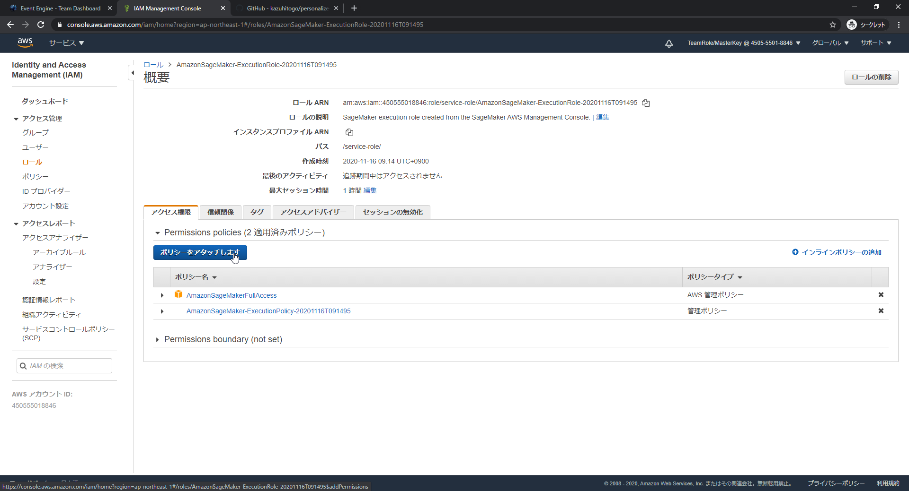

「AmazonS3FullAccess」「IAMFullAccess」「AmazonPersonalizeFullAccess」のポリシーを検索し、チェックを入れ、「ポリシーのアタッチ」をクリックします。

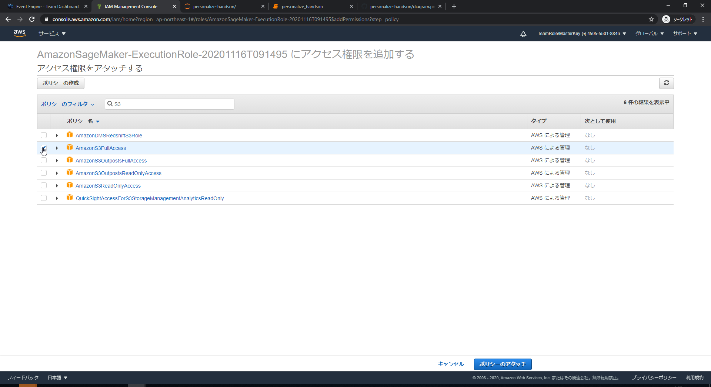

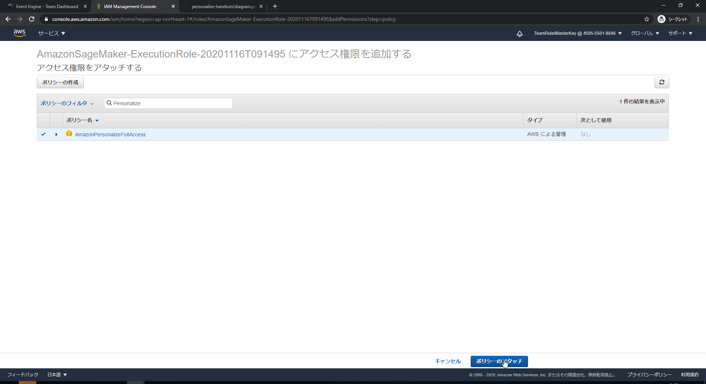

「IAMFullAccess」「AmazonS3FullAccess」「AmazonPersonalizeFullAccess」が追加で付与されていることを確認します。（全部で合計
5 ポリシー）

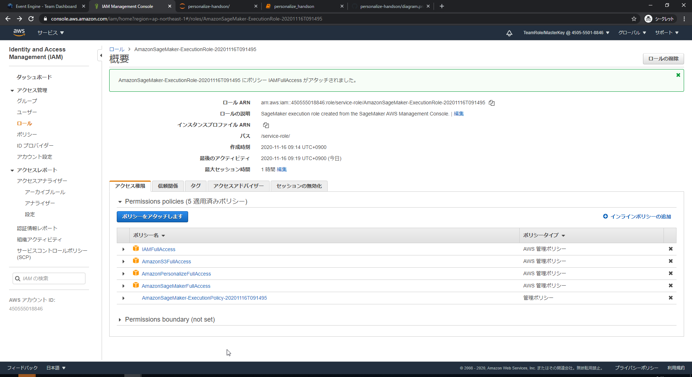

ノートブックインスタンスの画面に戻り、ステータスが「InService」になるまで待ち、「Jupyter
を開く」をクリックし、Jupyter Notebookの画面が開くのを待ちます。

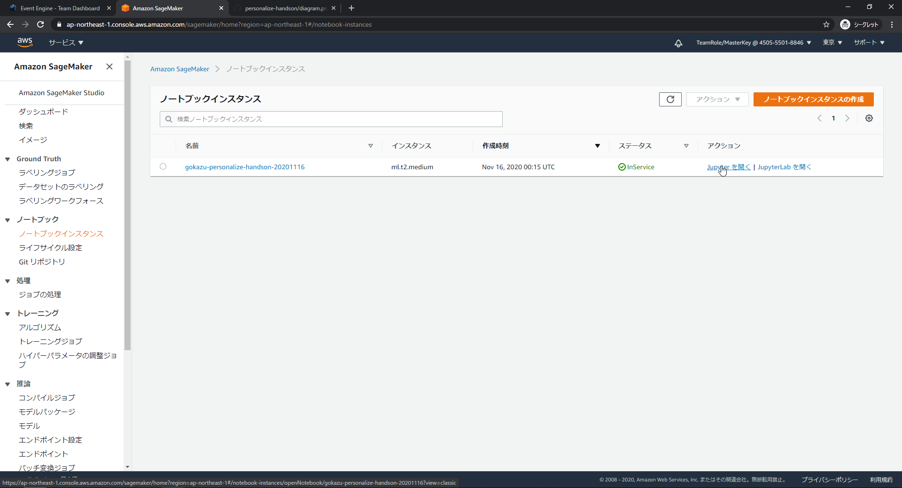

「personalize-handson」をクリックします。

「[data_preparation.ipynb](./data_preparation.ipynb)」を開いて実行したあと、「[personalize_handson.ipynb](./personalize_handson.ipynb)」を開きます。

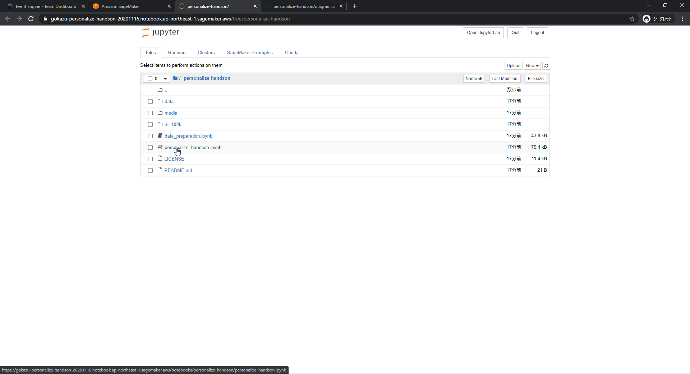

以降、ノートブックをご参照ください。
